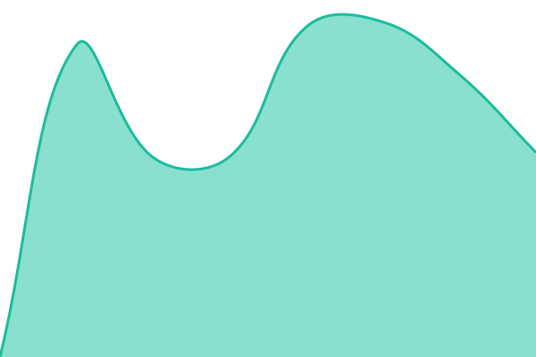
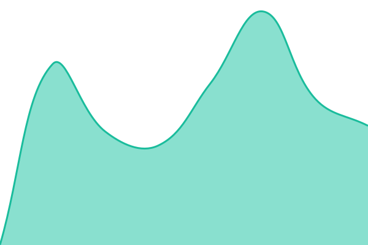
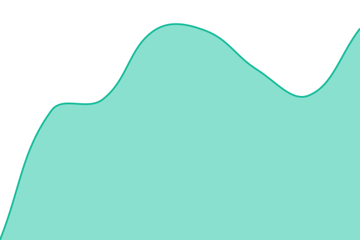
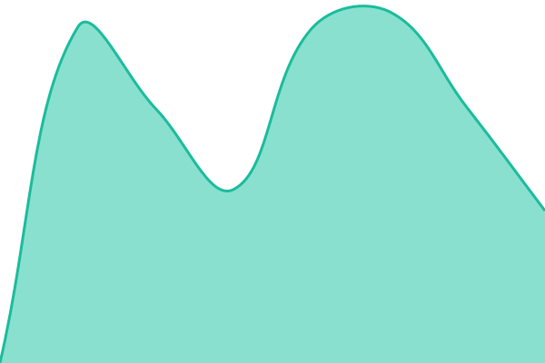
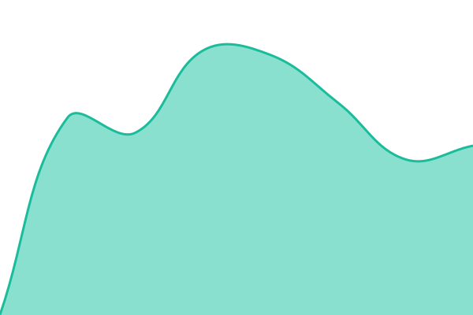
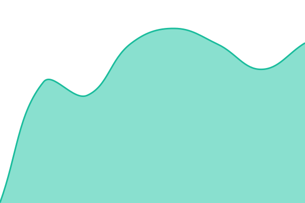
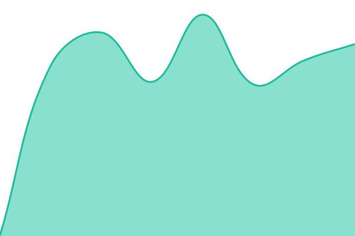

# [📈 Live Status](https://status.cantorgymnasium.de): <!--live status--> **🟩 All systems operational**

This repository contains the open-source uptime monitor and status page for [Georg-Cantor-Gymnasium](https://cantorgymnasium.de), powered by [Upptime](https://github.com/upptime/upptime).

With [Upptime](https://upptime.js.org), you can get your own unlimited and free uptime monitor and status page, powered entirely by a GitHub repository. We use [Issues](https://github.com/cantorgymnasium/status/issues) as incident reports, [Actions](https://github.com/cantorgymnasium/status/actions) as uptime monitors, and [Pages](https://status.cantorgymnasium.de) for the status page.

<!--start: status pages-->
<!-- This summary is generated by Upptime (https://github.com/upptime/upptime) -->
<!-- Do not edit this manually, your changes will be overwritten -->
<!-- prettier-ignore -->
| URL | Status | History | Response Time | Uptime |
| --- | ------ | ------- | ------------- | ------ |
|  [Gitea](https://git.cantorgymnasium.de/) | 🟩 Up | [gitea.yml](https://github.com/cantorgymnasium/status/commits/HEAD/history/gitea.yml) | 

 1560ms
     
 | 

<a href="https://status.cantorgymnasium.de/history/gitea">100.00%</a>
    

|  [mailcow UI](https://mail.cantorgymnasium.de/) | 🟩 Up | [mailcow-ui.yml](https://github.com/cantorgymnasium/status/commits/HEAD/history/mailcow-ui.yml) | 

 705ms
     
 | 

<a href="https://status.cantorgymnasium.de/history/mailcow-ui">99.21%</a>
    

|  [SOGo Webmail](https://mail.cantorgymnasium.de/SOGo/) | 🟩 Up | [so-go-webmail.yml](https://github.com/cantorgymnasium/status/commits/HEAD/history/so-go-webmail.yml) | 

 380ms
     
 | 

<a href="https://status.cantorgymnasium.de/history/so-go-webmail">99.22%</a>
    

|  [Nextcloud](https://cloud.cantorgymnasium.de/) | 🟩 Up | [nextcloud.yml](https://github.com/cantorgymnasium/status/commits/HEAD/history/nextcloud.yml) | 

 1077ms
     
 | 

<a href="https://status.cantorgymnasium.de/history/nextcloud">100.00%</a>
    

|  [Nextcloud AIO Interface](https://nc-admin.cantorgymnasium.de/) | 🟩 Up | [nextcloud-aio-interface.yml](https://github.com/cantorgymnasium/status/commits/HEAD/history/nextcloud-aio-interface.yml) | 

 875ms
     
 | 

<a href="https://status.cantorgymnasium.de/history/nextcloud-aio-interface">100.00%</a>
    

|  [GCG.Website](https://cantorgymnasium.de/) | 🟩 Up | [gcg-website.yml](https://github.com/cantorgymnasium/status/commits/HEAD/history/gcg-website.yml) | 

 716ms
     
 | 

<a href="https://status.cantorgymnasium.de/history/gcg-website">100.00%</a>
    

|  [GCG.Website (Test)](https://test.cantorgymnasium.de/) | 🟩 Up | [gcg-website-test.yml](https://github.com/cantorgymnasium/status/commits/HEAD/history/gcg-website-test.yml) | 

 705ms
     
 | 

<a href="https://status.cantorgymnasium.de/history/gcg-website-test">100.00%</a>
    

|  [GCG.Website (Dev)](https://dev.cantorgymnasium.de/) | 🟩 Up | [gcg-website-dev.yml](https://github.com/cantorgymnasium/status/commits/HEAD/history/gcg-website-dev.yml) | 

 698ms
     
 | 

<a href="https://status.cantorgymnasium.de/history/gcg-website-dev">100.00%</a>
    

|  [Grafana](https://grafana.cantorgymnasium.de/) | 🟩 Up | [grafana.yml](https://github.com/cantorgymnasium/status/commits/HEAD/history/grafana.yml) | 

 706ms
     
 | 

<a href="https://status.cantorgymnasium.de/history/grafana">100.00%</a>
    

|  [HedgeDoc](https://pads.cantorgymnasium.de/) | 🟩 Up | [hedge-doc.yml](https://github.com/cantorgymnasium/status/commits/HEAD/history/hedge-doc.yml) | 

 556ms
     
 | 

<a href="https://status.cantorgymnasium.de/history/hedge-doc">100.00%</a>
    

|  [Keycloak](https://id.cantorgymnasium.de/) | 🟩 Up | [keycloak.yml](https://github.com/cantorgymnasium/status/commits/HEAD/history/keycloak.yml) | 

 1194ms
     
 | 

<a href="https://status.cantorgymnasium.de/history/keycloak">100.00%</a>
    

|  [Matomo](https://analytics.cantorgymnasium.de/) | 🟩 Up | [matomo.yml](https://github.com/cantorgymnasium/status/commits/HEAD/history/matomo.yml) | 

 1025ms
     
 | 

<a href="https://status.cantorgymnasium.de/history/matomo">100.00%</a>
    

|  [POSTalion](https://forms.cantorgymnasium.de/status) | 🟩 Up | [pos-talion.yml](https://github.com/cantorgymnasium/status/commits/HEAD/history/pos-talion.yml) | 

 755ms
     
 | 

<a href="https://status.cantorgymnasium.de/history/pos-talion">99.22%</a>
    

|  [Portainer](http://docker.cantorgymnasium.de:9000/) | 🟩 Up | [portainer.yml](https://github.com/cantorgymnasium/status/commits/HEAD/history/portainer.yml) | 

 276ms
     
 | 

<a href="https://status.cantorgymnasium.de/history/portainer">100.00%</a>
    

|  [WikiJS](https://wiki.cantorgymnasium.de/) | 🟩 Up | [wiki-js.yml](https://github.com/cantorgymnasium/status/commits/HEAD/history/wiki-js.yml) | 

 825ms
     
 | 

<a href="https://status.cantorgymnasium.de/history/wiki-js">100.00%</a>
    

|  [Homer Dashboard](https://dash.cantorgymnasium.de/) | 🟩 Up | [homer-dashboard.yml](https://github.com/cantorgymnasium/status/commits/HEAD/history/homer-dashboard.yml) | 

 407ms
     
 | 

<a href="https://status.cantorgymnasium.de/history/homer-dashboard">100.00%</a>
    

|  [Webmin](https://webmin.cantorgymnasium.de:10000/) | 🟩 Up | [webmin.yml](https://github.com/cantorgymnasium/status/commits/HEAD/history/webmin.yml) | 

 753ms
     
 | 

<a href="https://status.cantorgymnasium.de/history/webmin">100.00%</a>
    

|  [DBGate](https://db.cantorgymnasium.de/) | 🟩 Up | [db-gate.yml](https://github.com/cantorgymnasium/status/commits/HEAD/history/db-gate.yml) | 

 440ms
     
 | 

<a href="https://status.cantorgymnasium.de/history/db-gate">100.00%</a>
    

|  [Marzipano](https://vr.cantorgymnasium.de/) | 🟩 Up | [marzipano.yml](https://github.com/cantorgymnasium/status/commits/HEAD/history/marzipano.yml) | 

 423ms
     
 | 

<a href="https://status.cantorgymnasium.de/history/marzipano">100.00%</a>
    

<!--end: status pages-->

[**Visit our status website →**](https://status.cantorgymnasium.de)

## 📄 License

- Powered by: [Upptime](https://github.com/upptime/upptime)
- Code: [MIT](./LICENSE) © [Georg-Cantor-Gymnasium](https://cantorgymnasium.de)
- Data in the `./history` directory: [Open Database License](https://opendatacommons.org/licenses/odbl/1-0/)
