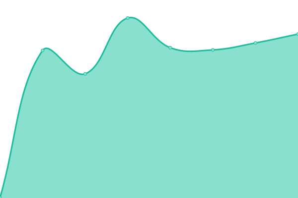
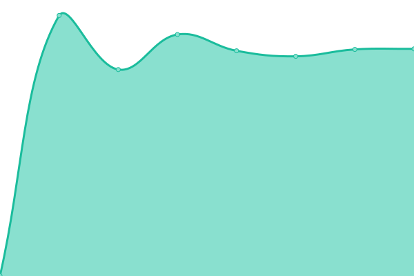

# [📈 Live Status](https://status.cantorgymnasium.de): <!--live status--> **🟧 Partial outage**

This repository contains the open-source uptime monitor and status page for [Georg-Cantor-Gymnasium](https://cantorgymnasium.de), powered by [Upptime](https://github.com/upptime/upptime).

With [Upptime](https://upptime.js.org), you can get your own unlimited and free uptime monitor and status page, powered entirely by a GitHub repository. We use [Issues](https://github.com/cantorgymnasium/status/issues) as incident reports, [Actions](https://github.com/cantorgymnasium/status/actions) as uptime monitors, and [Pages](https://status.cantorgymnasium.de) for the status page.

<!--start: status pages-->
<!-- This summary is generated by Upptime (https://github.com/upptime/upptime) -->
<!-- Do not edit this manually, your changes will be overwritten -->
<!-- prettier-ignore -->
| URL | Status | History | Response Time | Uptime |
| --- | ------ | ------- | ------------- | ------ |
|  [Gitea](https://git.cantorgymnasium.de/) | 🟩 Up | [gitea.yml](https://github.com/cantorgymnasium/status/commits/HEAD/history/gitea.yml) | 

 924ms
     
 | 

<a href="https://status.cantorgymnasium.de/history/gitea">99.21%</a>
    

|  [mailcow UI](https://mail.cantorgymnasium.de/) | 🟩 Up | [mailcow-ui.yml](https://github.com/cantorgymnasium/status/commits/HEAD/history/mailcow-ui.yml) | 

 836ms
     
 | 

<a href="https://status.cantorgymnasium.de/history/mailcow-ui">99.46%</a>
    

|  [SOGo Webmail](https://mail.cantorgymnasium.de/SOGo/) | 🟩 Up | [so-go-webmail.yml](https://github.com/cantorgymnasium/status/commits/HEAD/history/so-go-webmail.yml) | 

 136ms
     
 | 

<a href="https://status.cantorgymnasium.de/history/so-go-webmail">99.59%</a>
    

|  [Seafile](https://cloud.cantorgymnasium.de/) | 🟩 Up | [seafile.yml](https://github.com/cantorgymnasium/status/commits/HEAD/history/seafile.yml) | 

 737ms
     
 | 

<a href="https://status.cantorgymnasium.de/history/seafile">73.97%</a>
    

|  [GCG.Website](https://cantorgymnasium.de/) | 🟩 Up | [gcg-website.yml](https://github.com/cantorgymnasium/status/commits/HEAD/history/gcg-website.yml) | 

 698ms
     
 | 

<a href="https://status.cantorgymnasium.de/history/gcg-website">100.00%</a>
    

|  [GCG.Website (Test)](https://test.cantorgymnasium.de/) | 🟥 Down | [gcg-website-test.yml](https://github.com/cantorgymnasium/status/commits/HEAD/history/gcg-website-test.yml) | 

 739ms
     
 | 

<a href="https://status.cantorgymnasium.de/history/gcg-website-test">99.21%</a>
    

|  [GCG.Website (Dev)](https://dev.cantorgymnasium.de/) | 🟩 Up | [gcg-website-dev.yml](https://github.com/cantorgymnasium/status/commits/HEAD/history/gcg-website-dev.yml) | 

 682ms
     
 | 

<a href="https://status.cantorgymnasium.de/history/gcg-website-dev">99.34%</a>
    

|  [Grafana](https://grafana.cantorgymnasium.de/) | 🟥 Down | [grafana.yml](https://github.com/cantorgymnasium/status/commits/HEAD/history/grafana.yml) | 

 711ms
     
 | 

<a href="https://status.cantorgymnasium.de/history/grafana">99.04%</a>
    

|  [HedgeDoc](https://pads.cantorgymnasium.de/) | 🟥 Down | [hedge-doc.yml](https://github.com/cantorgymnasium/status/commits/HEAD/history/hedge-doc.yml) | 

 541ms
     
 | 

<a href="https://status.cantorgymnasium.de/history/hedge-doc">99.04%</a>
    

|  [Keycloak](https://id.cantorgymnasium.de/) | 🟥 Down | [keycloak.yml](https://github.com/cantorgymnasium/status/commits/HEAD/history/keycloak.yml) | 

 721ms
     
 | 

<a href="https://status.cantorgymnasium.de/history/keycloak">97.66%</a>
    

|  [Koha](https://bibo.cantorgymnasium.de/) | 🟩 Up | [koha.yml](https://github.com/cantorgymnasium/status/commits/HEAD/history/koha.yml) | 

 908ms
     
 | 

<a href="https://status.cantorgymnasium.de/history/koha">99.64%</a>
    

|  [Koha (Intra)](https://bibo-intra.cantorgymnasium.de/) | 🟩 Up | [koha-intra.yml](https://github.com/cantorgymnasium/status/commits/HEAD/history/koha-intra.yml) | 

 773ms
     
 | 

<a href="https://status.cantorgymnasium.de/history/koha-intra">99.64%</a>
    

|  [Matomo](https://analytics.cantorgymnasium.de/) | 🟩 Up | [matomo.yml](https://github.com/cantorgymnasium/status/commits/HEAD/history/matomo.yml) | 

 892ms
     
 | 

<a href="https://status.cantorgymnasium.de/history/matomo">99.76%</a>
    

|  [NGINX Proxy Manager](https://npm.cantorgymnasium.de/) | 🟥 Down | [nginx-proxy-manager.yml](https://github.com/cantorgymnasium/status/commits/HEAD/history/nginx-proxy-manager.yml) | 

 450ms
     
 | 

<a href="https://status.cantorgymnasium.de/history/nginx-proxy-manager">99.21%</a>
    

|  [OnlyOffice](https://docs.cantorgymnasium.de/) | 🟩 Up | [only-office.yml](https://github.com/cantorgymnasium/status/commits/HEAD/history/only-office.yml) | 

 537ms
     
 | 

<a href="https://status.cantorgymnasium.de/history/only-office">99.17%</a>
    

|  [PHP/Formtools](https://php.cantorgymnasium.de/formtools/) | 🟥 Down | [php-formtools.yml](https://github.com/cantorgymnasium/status/commits/HEAD/history/php-formtools.yml) | 

 596ms
     
 | 

<a href="https://status.cantorgymnasium.de/history/php-formtools">99.21%</a>
    

|  [Portainer](http://docker.cantorgymnasium.de:9000/) | 🟩 Up | [portainer.yml](https://github.com/cantorgymnasium/status/commits/HEAD/history/portainer.yml) | 

 383ms
     
 | 

<a href="https://status.cantorgymnasium.de/history/portainer">100.00%</a>
    

|  [Snipe-IT](https://snipe.cantorgymnasium.de/) | 🟥 Down | [snipe-it.yml](https://github.com/cantorgymnasium/status/commits/HEAD/history/snipe-it.yml) | 

 1536ms
     
 | 

<a href="https://status.cantorgymnasium.de/history/snipe-it">99.21%</a>
    

|  [WikiJS](https://wiki.cantorgymnasium.de/) | 🟥 Down | [wiki-js.yml](https://github.com/cantorgymnasium/status/commits/HEAD/history/wiki-js.yml) | 

 694ms
     
 | 

<a href="https://status.cantorgymnasium.de/history/wiki-js">99.04%</a>
    

|  [Homer Dashboard](https://dash.cantorgymnasium.de/) | 🟩 Up | [homer-dashboard.yml](https://github.com/cantorgymnasium/status/commits/HEAD/history/homer-dashboard.yml) | 

 394ms
     
 | 

<a href="https://status.cantorgymnasium.de/history/homer-dashboard">99.34%</a>
    

|  [Webmin](https://webmin.cantorgymnasium.de:10000/) | 🟩 Up | [webmin.yml](https://github.com/cantorgymnasium/status/commits/HEAD/history/webmin.yml) | 

 849ms
     
 | 

<a href="https://status.cantorgymnasium.de/history/webmin">100.00%</a>
    

|  [DBGate](https://db.cantorgymnasium.de/) | 🟩 Up | [db-gate.yml](https://github.com/cantorgymnasium/status/commits/HEAD/history/db-gate.yml) | 

 423ms
     
 | 

<a href="https://status.cantorgymnasium.de/history/db-gate">96.26%</a>
    

|  [Schülerzeitung](https://schuelerzeitung-gcg.de/) | 🟩 Up | [schuelerzeitung.yml](https://github.com/cantorgymnasium/status/commits/HEAD/history/schuelerzeitung.yml) | 

 599ms
     
 | 

<a href="https://status.cantorgymnasium.de/history/schuelerzeitung">99.46%</a>
    

|  [Schuelerzeitung (Test)](https://test.schuelerzeitung-gcg.de/) | 🟩 Up | [schuelerzeitung-test.yml](https://github.com/cantorgymnasium/status/commits/HEAD/history/schuelerzeitung-test.yml) | 

 597ms
     
 | 

<a href="https://status.cantorgymnasium.de/history/schuelerzeitung-test">99.46%</a>
    

|  [Marzipano](https://vr.cantorgymnasium.de/) | 🟩 Up | [marzipano.yml](https://github.com/cantorgymnasium/status/commits/HEAD/history/marzipano.yml) | 

 378ms
     
 | 

<a href="https://status.cantorgymnasium.de/history/marzipano">99.46%</a>
    

<!--end: status pages-->

[**Visit our status website →**](https://status.cantorgymnasium.de)

## 📄 License

- Powered by: [Upptime](https://github.com/upptime/upptime)
- Code: [MIT](./LICENSE) © [Georg-Cantor-Gymnasium](https://cantorgymnasium.de)
- Data in the `./history` directory: [Open Database License](https://opendatacommons.org/licenses/odbl/1-0/)
